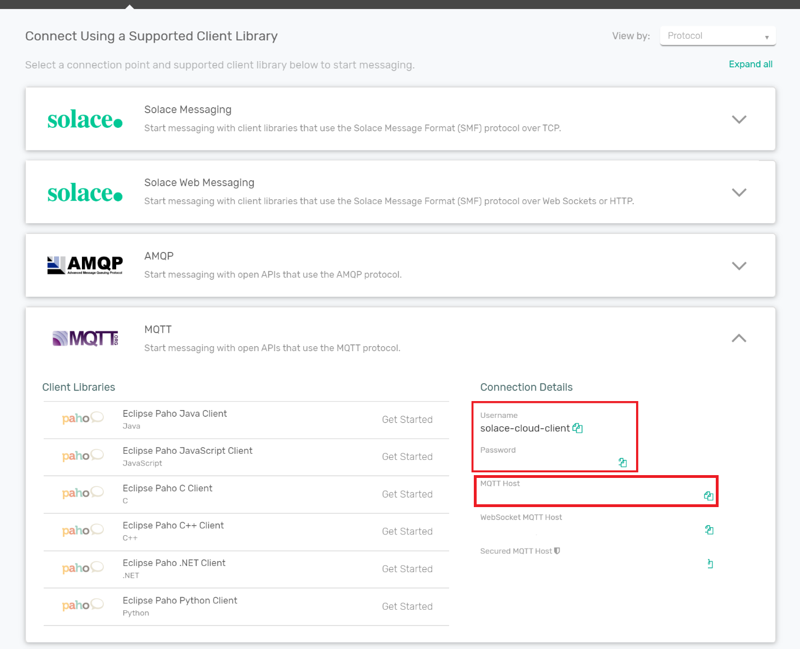

# rust-options-data-simulator
An MQTT based Rust application that simulates option market data

## Solace Setup

Use the following [link](https://docs.solace.com/Solace-Cloud/ggs_signup.htm) as a guide to sign up for a [FREE](https://console.solace.cloud/login/new-account) Solace PubSub+ Cloud instance ane make note of the credentials and 'MQTT Host','Username' and 'Password' from the MQTT section of the 'Connect' tab:



Alternatively - you can spin up a local docker container of Solace PubSub+ with the default settings and use the default credentials in the application.
 

## Building the application

Make sure you have [rust](https://www.rust-lang.org/tools/install) installed and run cargo build. 

The executable provides you with the following options:

```
OPTIONS:
        --mqtt-client-id <mqtt-client-id>
            The client-id of the MQTT connection [default: options_market_data_simulator]

        --mqtt-host <mqtt-host>                    The hostname of the MQTT broker [default: localhost]
        --mqtt-password <mqtt-password>            The mqtt password [default: default]
        --mqtt-port <mqtt-port>                    The mqtt port [default: 1883]
        --mqtt-username <mqtt-username>            The mqtt username [default: default]
        --number-of-options <number-of-options>    Number of option prices per symbol [default: 100]
        --publish-rate <publish-rate>              Publish rate per second [default: 10]
        --tickers <tickers>
            A list of strings for ticker symbols [default: AAPL,TSLA,MSFT,FB,GOOG,NFLX,CRM,AMD,INTL]
```

You will have to modify the mqtt host, port, username and password from your solace installation.

## Option data format

The options market data will be published on the topic `OPTIONS/MARKETDATA/<SYMBOL>` and the payload will be of the following format:

```
{"ticker":"AAPL","spot":964.5955,"option_expiry":0.09605623,"option_data":[{"direction":1,"strike":1000.0,"risk_free_rate":0.061666578,"volatility":0.030105356,"dividend_yield":0.5828167}...}
```